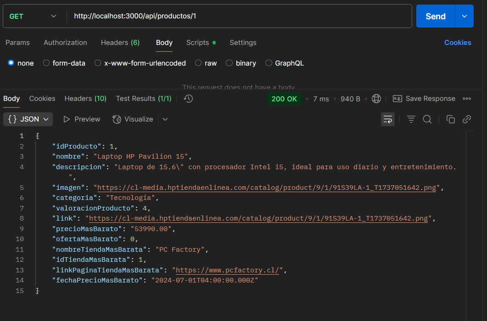

# Proyecto Final ICI4247-1: Price Compare

## Sistema de Comparación de Precios y Seguimiento de Ofertas

---
## Presentado por:
- Patricio Figueroa  
- Marcelo Flores  
- Kavon Kermani  
- Gabriel Sanzana  
- Lucas Zamora  
---

## Índice
1. [Resumen del Proyecto](#resumen-del-proyecto)
2. [Requerimientos](#requerimientos)
   - [Requerimientos Funcionales por Rol](#requerimientos-funcionales-por-rol)
   - [Requerimientos No Funcionales](#requerimientos-no-funcionales)
3. [Arquitectura de la Información](#arquitectura-de-la-información)
4. [Diseño de Prototipos](#diseño-de-prototipos)
5. [Demostracion de funcionamiento de las APIs con POSTMAN](#demostracion-de-funcionamiento-de-las-apis-con-postman)
5. [Definición de Navegación y UX](#definición-de-navegación-y-ux)
6. [Principios de Diseño UX](#principios-de-diseño-ux)
7. [Seguridad de Contraseñas](#seguridad-de-contraseñas)
8. [Tecnologías](#tecnologías)
9. [Estructura del Proyecto](#estructura-del-proyecto)
10. [Funcionalidades Implementadas](#funcionalidades-implementadas)
11. [Instalación](#instalación)

---

## Resumen del Proyecto

**Price Compare** es una plataforma que permite a los usuarios comparar precios de productos, visualizar su historial de precios en distintas tiendas y acceder a reseñas de otros usuarios. Está inspirado en herramientas como Knasta o Solotodo, y busca entregar información actualizada sobre el valor histórico más barato de un producto, su evolución en el tiempo, y las experiencias de otros compradores.

---

## Requerimientos

### Roles del Sistema
* **Usuario**: Puede navegar, buscar productos, ver valoraciones, acceder al historial de precios, y dejar reseñas si está logueado.
* **Administrador**: Gestiona productos y usuarios desde el backend.

### Requerimientos Funcionales por Rol

#### Rol - Usuario
* **RF-USR-01:** Puede buscar y visualizar productos.
* **RF-USR-02:** Puede ver la valoración de un producto.
* **RF-USR-03:** Si está logueado, puede escribir reseñas.
* **RF-USR-04:** Puede ver el precio más barato histórico, su fecha y el link de la tienda.
* **RF-USR-05:** Puede ver el historial de precios del producto por tienda.
* **RF-USR-06:** Puede acceder a la sección de tiendas desde el header.
* **RF-USR-07:** Puede registrarse como nuevo usuario e iniciar sesión.

#### Rol - Administrador
* **RF-ADM-01:** Puede agregar, editar o eliminar productos desde el backend.

### Requerimientos No Funcionales

* **RNF-01:** Tiempo de respuesta inferior a 2 segundos en el 95% de las peticiones.
* **RNF-02:** Seguridad en la autenticación y restricción de funcionalidades.
* **RNF-03:** Interfaz responsive y de fácil navegación.
* **RNF-04:** Compatibilidad con los principales navegadores.
* **RNF-05:** Escalabilidad para nuevos productos y tiendas.

---

## Arquitectura de la Información

* Secciones: Home, Tiendas, Login, Registro, Detalle de producto.
* Navegación implementada con Angular Router.
* Backend en Node.js con Express y MySQL.

---

## Diseño de Prototipos

* Mockups realizados para Home, Detalle Producto, Tiendas, Login y Registro.
* Ver diseño completo en [Figma](https://www.figma.com/design/27nvS768OmbEAa1kWNkBae/Solotodo?node-id=176-10268&t=Q1tA8qiBHgqHZT0g-1)

---

## Demostracion de funcionamiento de las APIs con POSTMAN

* Las APIs están definidas inicialmente en Tralalero_server/index.js y luego separadas en la carpeta Tralalero_server/routes. Por ejemplo, si se desea utilizar una API para mostrar la información de un producto, el flujo sería el siguiente:

Archivo: **Tralalero_server/index.js**
   app.use('/api/productos', productRoutes);

Archivo: **Tralalero_server/routes/product.js**
   router.get('/buscar', productController.buscarProductos);

Por lo tanto, una ruta para acceder a un producto por su ID podría tener la siguiente forma:

/api/productos/:id

A continuación, se muestra una imagen en POSTMAN que demuestra el funcionamiento de esta API:

   

---


## Definición de Navegación y UX

* Desde el Home, se puede acceder al detalle de cada producto.
* Desde el Header, se accede a Tiendas y a Registro/Login.
* El detalle del producto muestra:
  - Imagen, nombre, precio actual.
  - Valoración promedio.
  - Historial de precios.
  - Precio mínimo con link y fecha.
  - Reseñas (si estás logueado, puedes escribir una).

---

## Principios de Diseño UX

* **Simplicidad:** interfaz clara y minimalista.
* **Accesos rápidos:** con funciones clave desde el header.
* **Visualización clara:** precios, valoraciones y reseñas.
* **Responsivo y adaptable:** funciona bien en escritorio y dispositivos móviles con el menú hamburguesa.

---

## Seguridad de Contraseñas

* Las contraseñas de los usuarios se almacenan de forma segura en la base de datos.
* Antes de ser guardadas, se procesan mediante un algoritmo de hashing (bcrypt).
* No se guarda ninguna contraseña en texto plano.
* Durante el proceso de autenticación, la contraseña ingresada se compara contra el hash almacenado.
* Esta medida mejora la seguridad y privacidad de los datos de los usuarios registrados.

---

## Tecnologías

* **Frontend:** Ionic + Angular
* **Backend:** Node.js + Express
* **Base de Datos:** MySQL
* **Gestión BD:** phpMyAdmin (exportando cambios a `.sql`)
* **Lenguaje:** TypeScript, JavaScript, html, scss
* **Control de versiones:** GitHub


---

## Estructura del Proyecto


```text
TralaleroWeb/
├── README.md
├── Tralero_server/                   # Backend del proyecto
└── TraleroWeb/                       # Frontend del proyecto
    └── src/
        └── app/
            ├── components/
            │   ├── footer/           # Componente del pie de página, visible en todas las vistas principales
            │   └── header/           # Componente del encabezado, incluye navegación como login, tiendas, etc.
            ├── models/
            │   ├── datosLogin.ts     # Modelo de datos para manejar credenciales de inicio de sesión
            │   ├── producto.ts       # Modelo que representa la estructura de un producto
            │   ├── tienda.ts         # Modelo que representa la estructura de una tienda
            │   └── usuario.ts        # Modelo que representa los datos de un usuario
            ├── pages/
            │   ├── buscar-producto/  # Página que permite buscar productos desde el buscador superior
            │   ├── categorias/       # Página de categorías (desactivada actualmente)
            │   ├── home/             # Página principal donde se muestran los productos destacados o nuevos
            │   ├── login/            # Página de inicio de sesión de usuarios
            │   ├── producto/         # Página de detalle de un producto específico, con historial y reseñas
            │   ├── register/         # Página de registro para nuevos usuarios
            │   └── tiendas/          # Página que muestra las tiendas disponibles con su valoración
            └── services/
                ├── producto.service.spec.ts  # Test del servicio de productos
                ├── producto.service.ts       # Servicio para obtener productos desde el backend
                ├── tienda.service.spec.ts    # Test del servicio de tiendas
                ├── tienda.service.ts         # Servicio para obtener datos de tiendas
                ├── usuarios.service.spec.ts  # Test del servicio de usuarios
                └── usuarios.service.ts       # Servicio para login, registro y manejo de usuarios
```

---

## Funcionalidades Implementadas

* Visualización de productos en Home con imagen, nombre y precio.
* Acceso a detalle del producto con:
  - Valoración y reseñas si el usuario está logueado.
  - Precio más barato registrado (histórico) con su fecha y link de tienda.
* Login y Registro de usuario.
* Sección de tiendas accesible desde el header.
* Backend funcional con Node.js y base de datos MySQL.
* Archivo `usuarios.txt` en `Tralalero_server` con credenciales de prueba.

---

## Instalación

Para correr este proyecto en tu máquina local, sigue los siguientes pasos:

1. Clona este repositorio:
   ```bash
   git clone https://github.com/LucasDZamora/TralaleroWeb.git
2. Iniciar el backend
   ```bash
   cd Tralalero_server
3. Correr el servidor
   ```bash
   node index.js
4. Navega al directorio frontend del proyecto
   ```bash
    cd TraleroWeb
5. Instala las dependencias
   ```bash
    npm install
6. Corre la aplicación
   ```bash
    ionic serve
